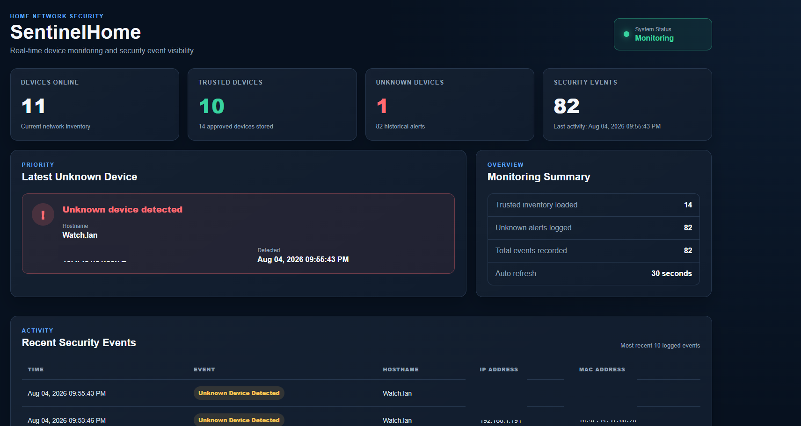
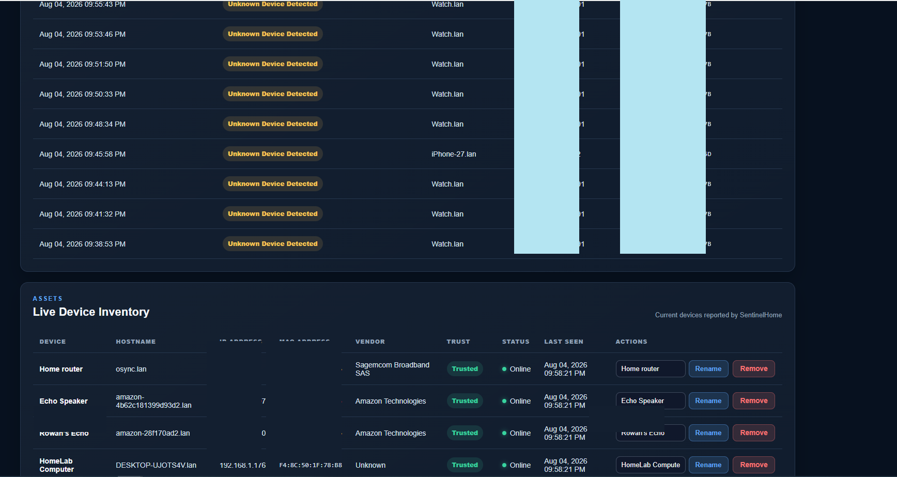
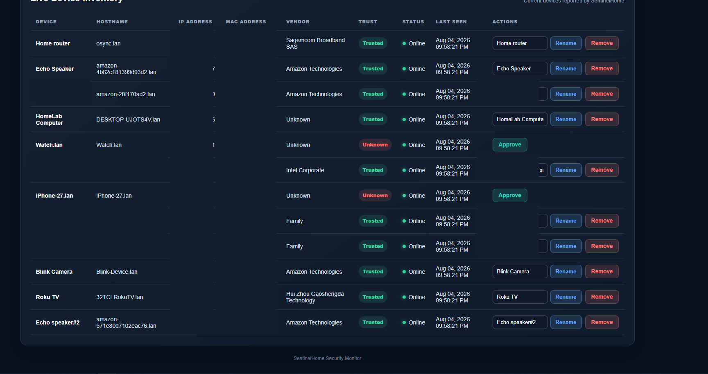
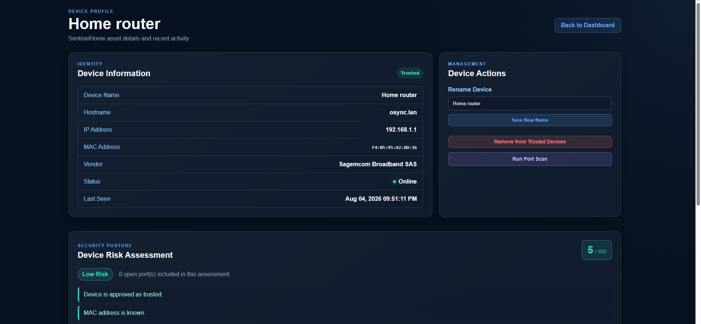
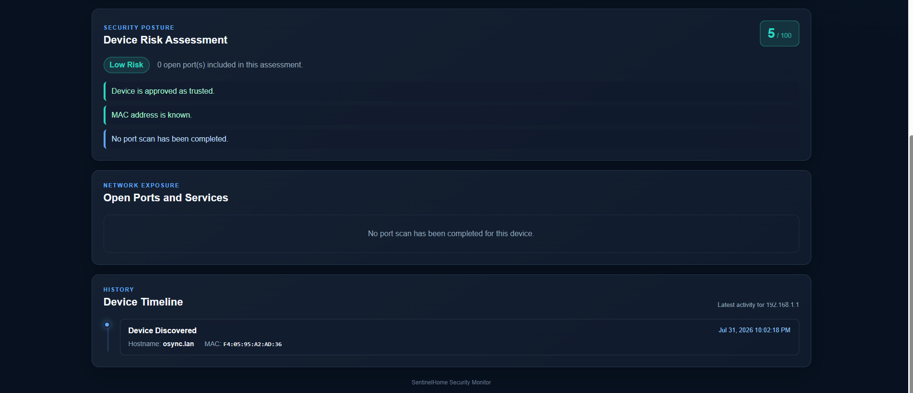

# 🛡️ SentinelHome 2.0

SentinelHome is a Python-based home network security monitoring application designed to provide real-time visibility into devices connected to a local network.

The application discovers network devices, maintains a trusted-device inventory, identifies unknown devices, logs security events, performs device risk assessments, supports on-demand port scanning, and provides an interactive Flask-based security dashboard.

SentinelHome began as a simple network discovery project and has evolved into a more complete home network security monitoring platform.

---

## Overview

SentinelHome was developed as a hands-on cybersecurity portfolio project to strengthen practical skills in network monitoring, security engineering, Python development, and defensive security.

The project provides a controlled environment for working with concepts commonly used in security operations, including:

- Asset discovery
- Network visibility
- Unknown-device detection
- Security event logging
- Device classification
- Risk assessment
- Port scanning
- Trusted asset management
- Security dashboard development

The goal is to continue expanding SentinelHome as I develop additional cybersecurity and security engineering skills.

---

## What's New in SentinelHome 2.0

SentinelHome 2.0 significantly expands the original project.

### Redesigned Security Dashboard

The dashboard provides a centralized view of the current security state of the network, including:

- Devices currently online
- Trusted devices
- Unknown devices
- Security event totals
- Latest unknown-device detection
- Monitoring status
- Recent security events
- Live device inventory
- Automatic dashboard refresh

### Live Device Inventory

SentinelHome maintains a live inventory of discovered network assets and displays:

- Device name
- Hostname
- IP address
- MAC address
- Vendor
- Trust status
- Online status
- Last-seen timestamp

### Unknown Device Detection

Devices that are not present in the trusted inventory are automatically identified as unknown.

Unknown-device detections are:

- Displayed prominently on the dashboard
- Recorded as security events
- Added to historical event logs
- Available for review and approval

### Device Management

Devices can be managed directly through the web interface.

Current management capabilities include:

- Approve unknown devices
- Add devices to the trusted inventory
- Rename devices
- Remove devices from the trusted inventory
- View detailed device information

### Device Profile Pages

Individual device profiles provide a more detailed view of each network asset.

Device profiles include:

- Device identity information
- Hostname
- Network addressing information
- Vendor information
- Trust status
- Online status
- Last-seen activity
- Device management controls
- Security posture information

### Device Risk Assessment

SentinelHome evaluates device information and presents a risk score to help identify devices that may require additional review.

Risk assessments can consider information such as:

- Trusted or unknown status
- Known device information
- Network exposure
- Open ports discovered during scanning

### On-Demand Port Scanning

Port scans can be initiated directly from a device profile.

Scan results provide additional visibility into network services exposed by a device and can be incorporated into the device's security assessment.

### Security Event Logging

SentinelHome maintains historical security events for later review.

Events include information such as:

- Detection time
- Event type
- Hostname
- Network identifiers
- Device information

---

## Core Features

- Live network device discovery using Nmap
- Trusted-device inventory
- Unknown-device detection
- Security event logging
- Real-time Flask dashboard
- Live device inventory
- Device profile pages
- Device approval workflow
- Device renaming
- Trusted-device removal
- Device risk scoring
- On-demand port scanning
- Online/offline device status
- Last-seen tracking
- Historical security events
- Automatic dashboard refresh
- Modular Python architecture
- Persistent application data

---

## Technologies

- Python 3
- Flask
- Nmap
- HTML
- CSS
- JavaScript
- Jinja2
- JSON
- SQLite
- PowerShell
- Git
- GitHub
- Windows
- Visual Studio Code

---

## Project Structure

```text
SentinelHome/
│
├── data/
│   └── sentinelhome.db
│
├── docs/
│   ├── architecture.md
│   ├── changelog.md
│   └── roadmap.md
│
├── logs/
│   ├── alerts.log
│   ├── errors.log
│   ├── port_scan_results.json
│   └── sentinelhome_events.jsonl
│
├── modules/
│   ├── config.py
│   ├── dashboard_data.py
│   ├── database.py
│   ├── event_logger.py
│   ├── inventory.py
│   ├── live_inventory.py
│   ├── notifier.py
│   ├── scanner.py
│   ├── trusted_manager.py
│   └── utils.py
│
├── screenshots/
├── static/
├── templates/
├── tests/
│
├── dashboard.py
├── sentinelhome.py
├── requirements.txt
└── README.md
```

> Project structure may continue to change as SentinelHome is developed.

---

## Screenshots

Screenshots shown in this repository are sanitized to remove or obscure sensitive network identifiers.

### Security Monitoring Dashboard



### Security Events



### Live Device Inventory



### Device Profile



### Device Risk Assessment, Network Exposure, and Timeline



---

---

## Installation

### Clone the repository

```bash
git clone https://github.com/Croberts20fla/SentinelHome.git
cd SentinelHome
```

### Install dependencies

```bash
pip install -r requirements.txt
```

Nmap must also be installed on the host system and available to SentinelHome.

### Run SentinelHome

```bash
python sentinelhome.py
```

### Launch the dashboard

```bash
python dashboard.py
```

Then open:

```text
http://127.0.0.1:5000
```

---

## Security and Privacy

SentinelHome is designed for use on networks that the operator owns or is authorized to monitor.

Screenshots published in this repository are sanitized to avoid unnecessarily exposing internal network information.

Runtime data, logs, trusted-device information, and other environment-specific information should be reviewed before being committed to a public repository.

---

## Roadmap

SentinelHome will continue to evolve as additional security capabilities are developed.

Potential future improvements include:

- Wazuh SIEM integration
- Enhanced vulnerability analysis
- Expanded risk-scoring logic
- Historical device analytics
- Email or mobile security notifications
- Authentication and access controls
- Improved reporting
- AI-assisted device analysis
- Docker deployment
- Cloud-based monitoring capabilities

See `docs/roadmap.md` for additional development plans.

---

## Why I Built This

I built SentinelHome because I wanted to move beyond studying cybersecurity concepts and apply them to a working project.

Building the application has required me to work through real technical problems involving network discovery, device identification, application architecture, security monitoring, logging, troubleshooting, and data presentation.

SentinelHome demonstrates hands-on experience with:

- Python development
- Network discovery
- Security monitoring
- Asset management
- Security event logging
- Risk assessment concepts
- Network troubleshooting
- Flask web development
- Data persistence
- Git and GitHub workflows

The project will continue to grow as I expand my cybersecurity and security engineering knowledge.

---

## About Me

I hold a Bachelor of Science in Information Technologies and am pursuing a Master of Science in Cybersecurity Risk Management at Indiana University.

My current areas of focus include:

- Security Engineering
- Blue Team Operations
- Cybersecurity Risk Management
- Threat Detection
- Cloud Security
- SIEM
- Python Automation

### GitHub

https://github.com/Croberts20fla

### LinkedIn

www.linkedin.com/in/christopher-roberts-324b3b219

---

## Disclaimer

SentinelHome is an educational and cybersecurity portfolio project. Network scanning and monitoring should only be performed on systems and networks you own or have explicit authorization to test.

---

## License

This project is licensed under the MIT License.